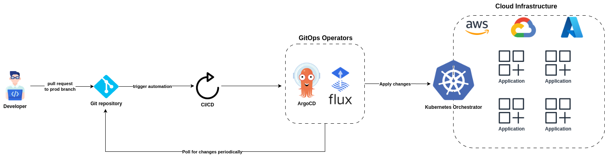

# gitops-cookbook

Collection of projects based on GitOps approach

## What is GitOps?

[**GitOps**](https://www.atlassian.com/git/tutorials/gitops) is a modern DevOps approach where **Git is the single source of truth** for infrastructure and application deployment.

- You **store all configuration and deployment code** (e.g., Kubernetes manifests, Terraform files) in a **Git repository**.
- Any change (infra or app) is done via a **Git commit + pull request**.
- A **GitOps operator** (like ArgoCD or Flux) **automatically syncs** the live system with the Git repo by using **orchestrator** such as **Kubernetes**
- If the actual state drifts from the desired state in Git, the system will **reconcile it automatically**.

### Core Principles of GitOps

- A system managed by GitOps must have its desired state expressed declaratively.
- Desired state is stored in a way that enforces immutability, versioning and retains a complete version history.
- Software agents automatically pull the desired state declarations from the source.
- Software agents continuously observe actual system state and attempt to apply the desired state.

### Key Benefits:
- **Version control** for everything
- **Auditability** (you know who changed what and when)
- **Automation** (CI/CD pipelines and auto-sync)
- **Rollback** by reverting a Git commit

## Projects
- [Basics of ArgoCD](./argocd-intro/)
- [Demo of deploying Flux operator into Minikube cluster and connecting it to the Github repository](https://github.com/Brain2life/flux-demo)
- [Tetris game app deployment via ArgoCD and GitHub](./argocd-app-deployment/)

## References
- [O'Reilly GitOps Cookbook repository: github.com/gitops-cookbook](https://github.com/gitops-cookbook)
- [OpenGitOps: GitOps Principles v1.0.0](https://opengitops.dev/)