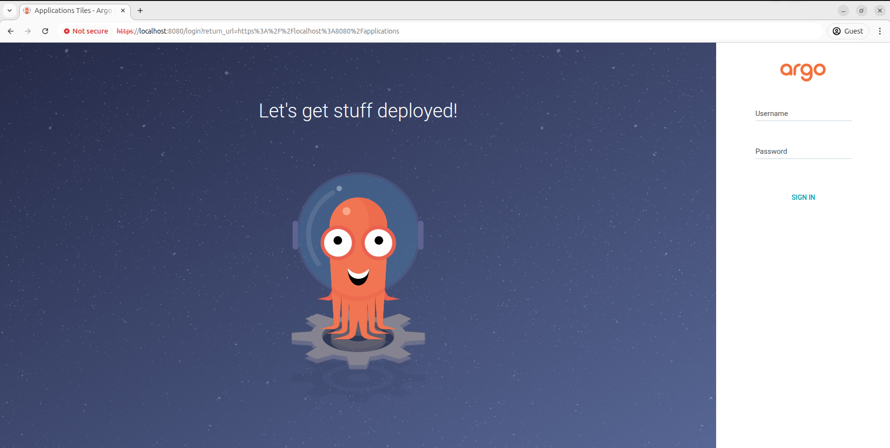

# Deploying an application with ArgoCD

## ArgoCD overview

[Argo CD](https://argoproj.github.io/cd/) is a declarative, GitOps continuous delivery tool for Kubernetes. Argo CD controller in Kubernetes cluster continuously monitors the state of your cluster and compares it with the desired state defined in Git. If the cluster state does not match the desired state, Argo CD reports the deviation and provides visualizations to help developers manually or automatically sync the cluster state with the desired state.

Argo CD offers 3 ways to manage your application state:
- **CLI** - A powerful CLI that lets you create YAML resource definitions for your applications and sync them with your cluster.
- **User Interface** - A web-based UI that lets you do the same things that you can do with the CLI. It also allows you to visualize the Kubernetes resources associated with the Argo CD applications you create.
- **Kubernetes manifests** and **Helm charts** applied to the cluster.


## EKS Cluster

To provision EKS cluster, use the following example: [EKS with Managed Node Groups](https://github.com/Brain2life/terraform-cookbook/tree/main/eks-with-managed-node-group)

To deploy cluster, run:
```bash
terraform apply
```

To update your local kubeconfig file and access cluster, run:
```bash
aws eks update-kubeconfig --region us-east-1 --name eks-cluster
```

## Installing ArgoCD

Install ArgoCD into the cluster by using Helm:
```bash
helm repo add argo-cd https://argoproj.github.io/argo-helm
helm upgrade --install argocd argo-cd/argo-cd --version "${ARGOCD_CHART_VERSION}" \
  --namespace "argocd" --create-namespace \
  --values <path_to_your_values.yaml> \
  --wait
```

`--values` flag -  points to a YAML file that overrides default settings in the Argo CD Helm chart. This file is used to **customize the Argo CD installation**, and it's very common in production to define tailored settings for security, performance, and integration.

For example:
```bash
helm repo add argo-cd https://argoproj.github.io/argo-helm
helm upgrade --install argocd argo-cd/argo-cd --version "8.0.1" \
  --namespace "argocd" --create-namespace \
  --wait
```

The latest releases of the Helm chart can be found here: [github.com/argoproj/argo-helm/releases](https://github.com/argoproj/argo-helm/releases)

Alternative and simpler way to install ArgoCD is to use plain Kubernetes manifest file (**NOTE**: It is best to use this installation type for `dev` environments. Use Helm chart for `prod` installation):
```bash
kubectl create namespace argocd
kubectl apply -n argocd -f https://raw.githubusercontent.com/argoproj/argo-cd/stable/manifests/install.yaml
```

To verify the installation, run:
```bash
kubectl get all -n argocd
```

If you need to delete the installation:
```bash
kubectl delete -n argocd -f https://raw.githubusercontent.com/argoproj/argo-cd/stable/manifests/install.yaml
```

In order to access the server UI you have the following options:

1. `kubectl port-forward service/argocd-server -n argocd 8080:443`

    and then open the browser on http://localhost:8080 and accept the certificate

    

2. enable ingress in the values file `server.ingress.enabled` and either
      - Add the annotation for ssl passthrough: https://argo-cd.readthedocs.io/en/stable/operator-manual/ingress/#option-1-ssl-passthrough
      - Set the `configs.params."server.insecure"` in the values file and terminate SSL at your ingress: https://argo-cd.readthedocs.io/en/stable/operator-manual/ingress/#option-2-multiple-ingress-objects-and-hosts


After reaching the UI the first time you can login with username: `admin` and the random password generated during the installation. You can find the password by running:

`kubectl -n argocd get secret argocd-initial-admin-secret -o jsonpath="{.data.password}" | base64 -d`

(You should delete the initial secret afterwards as suggested by the Getting Started Guide: https://argo-cd.readthedocs.io/en/stable/getting_started/#4-login-using-the-cli)

## Uninstall ArgoCD Helm release

To delete a Helm release, use the `helm uninstall` command. Here’s how:

1. **List Helm Releases** (to find the release name):
   ```bash
   helm list -n <namespace>
   ```
   Replace `<namespace>` with the namespace where the release is deployed. If you don’t specify a namespace, it lists releases in the default namespace.

2. **Delete the Release**:
   ```bash
   helm uninstall <release-name> -n <namespace>
   ```
   - `<release-name>`: The name of the release to delete (from the `helm list` output).
   - `-n <namespace>`: The namespace of the release (optional if in the default namespace).

   Example:
   ```bash
   helm uninstall my-app -n production
   ```

3. **Optional Flags**:
   - `--keep-history`: Keeps the release history (default is to delete it).
   - `--dry-run`: Simulates the uninstallation without actually deleting.
   - `--wait`: Waits until all resources are deleted before completing the command.

4. **Verify Deletion**:
   Run `helm list -n <namespace>` again to confirm the release is gone.

**Notes**:
- If the release is stuck or partially deleted, you may need to manually clean up Kubernetes resources using `kubectl delete` for associated objects (e.g., deployments, services).
- Ensure you have the correct permissions in the namespace.
- If you want to delete all releases in a namespace, you can script it or use `helm uninstall` for each release listed.

For more details, check the Helm documentation: https://helm.sh/docs/helm/helm_uninstall/

## Customizing ArgoCD installation

To override the default ArgoCD installation settings and customize to your environment use `--values` flag in Helm chart installation command.

The common settings you typically will see in a production `values.yaml` for ArgoCD are:
- Configuring **Admin password/authentication** for ArgoCD Server
- Configuring **TLS/Ingress settings** for ArgoCD UI to connect via custom domain with HTTPS
- Configuring **RBAC access** to specific users/groups via SSO/OIDC
- Configuring **repository credentials** to connect to private Git repos with SSH or HTTPS tokens
- **Customizing resources (CPU/memory settings)** for ArgoCD components: controller, repository server, api, etc. 
- **Disabling unused featues** (e.g. `dex`) for minimal and secure setups
- **Enabling notifications** to send ArgoCD deployment updates to Slack or other tools

To save and view the default values of ArgoCD Helm Chart use the following command:
```bash
helm show values argo-cd/argo-cd > ardocd-default-values.yaml
```

Alternative way is to use `helm template` command to convert Helm chart to a Kubernetes manifest files:
```bash
helm template argo argo-cd/argo-cd --output-dir argocd-manifests
```

This will output the raw manifest files for ArgoCD components without installing them into Kubernetes cluster:
```bash
.
├── argocd-application-controller
│   ├── clusterrolebinding.yaml
│   ├── clusterrole.yaml
│   ├── rolebinding.yaml
│   ├── role.yaml
│   ├── serviceaccount.yaml
│   └── statefulset.yaml
├── argocd-applicationset
│   ├── deployment.yaml
│   ├── rolebinding.yaml
│   ├── role.yaml
│   ├── serviceaccount.yaml
│   └── service.yaml
├── argocd-configs
│   ├── argocd-cmd-params-cm.yaml
│   ├── argocd-cm.yaml
│   ├── argocd-gpg-keys-cm.yaml
│   ├── argocd-notifications-cm.yaml
│   ├── argocd-notifications-secret.yaml
│   ├── argocd-rbac-cm.yaml
│   ├── argocd-secret.yaml
│   ├── argocd-ssh-known-hosts-cm.yaml
│   └── argocd-tls-certs-cm.yaml
├── argocd-notifications
│   ├── clusterrolebinding.yaml
│   ├── clusterrole.yaml
│   ├── deployment.yaml
│   ├── rolebinding.yaml
│   ├── role.yaml
│   └── serviceaccount.yaml
├── argocd-repo-server
│   ├── deployment.yaml
│   ├── rolebinding.yaml
│   ├── role.yaml
│   ├── serviceaccount.yaml
│   └── service.yaml
├── argocd-server
│   ├── clusterrolebinding.yaml
│   ├── clusterrole.yaml
│   ├── deployment.yaml
│   ├── rolebinding.yaml
│   ├── role.yaml
│   ├── serviceaccount.yaml
│   └── service.yaml
├── crds
│   ├── crd-applicationset.yaml
│   ├── crd-application.yaml
│   └── crd-project.yaml
├── dex
│   ├── deployment.yaml
│   ├── rolebinding.yaml
│   ├── role.yaml
│   ├── serviceaccount.yaml
│   └── service.yaml
├── redis
│   ├── deployment.yaml
│   ├── health-configmap.yaml
│   └── service.yaml
└── redis-secret-init
    ├── job.yaml
    ├── rolebinding.yaml
    ├── role.yaml
    └── serviceaccount.yaml
```

To get the whole Helm chart file, use the following command:
```bash
helm fetch argo-cd/argo-cd
# Unpack the package
tar -zxvf argo-cd-<version>.tgz
```

## ArgoCD Helm Chart Components

The Helm chart deploys the following core components of Argo CD:

- **argocd-application-controller** *(StatefulSet)*  
  Responsible for continuously monitoring and reconciling the desired application state defined in Git with the actual state in the Kubernetes cluster.

- **argocd-applicationset** *(Deployment)*  
  Manages and automatically generates multiple Argo CD Applications from a single template using generators such as Git, clusters, or Helm values.

- **argocd-notifications** *(Deployment)*  
  Sends notifications about Argo CD events to external systems like Slack, email, or webhooks.

- **argocd-repo-server** *(Deployment)*  
  Handles interactions with Git repositories and renders manifests. It provides an API for other components to retrieve application source data.

- **argocd-server** *(Deployment)*  
  The main API server and UI frontend of Argo CD. It exposes endpoints for users and tools to manage applications and configurations.

- [**dex**](https://argo-cd.readthedocs.io/en/stable/operator-manual/user-management/#dex) *(Deployment)*  
  An identity provider used for authenticating users via external systems such as GitHub, Google, LDAP, or SAML using the OpenID Connect (OIDC) protocol.

- **redis** *(Deployment)*  
  Provides caching to reduce load on the Kubernetes API server and Git providers, improving performance and scalability.

- **redis-secret-init** *(Job or InitContainer)*  
  Initializes Kubernetes Secrets used by the Redis deployment. Ensures that authentication credentials or encryption keys are created before Redis starts.

## Docker images used in ArgoCD Helm Chart

The default ArgoCD Helm chart (e.g. `8.0.1`) uses the following Docker images:
- `quay.io/argoproj/argocd`
- `ghcr.io/dexidp/dex`
- `public.ecr.aws/docker/library/redis`

[**quay.io/argoproj/argocd**](https://quay.io/repository/argoproj/argocd?tab=tags&tag=latest)  
This is the **main Argo CD image** used for multiple components like:
- argocd-server
- argocd-application-controller
- argocd-repo-server
- argocd-applicationset

It contains the Argo CD binaries that power the UI, API, Git sync logic, and application reconciliation.

[**ghcr.io/dexidp/dex**](https://github.com/dexidp/dex/pkgs/container/dex)  
This is the DEX Identity Provider image.
- Used by dex-server which Argo CD uses for SSO (Single Sign-On) via OIDC, LDAP, GitHub, GitLab, etc.
- Allows user authentication without hardcoding users in Argo CD.

[**public.ecr.aws/docker/library/redis**](https://gallery.ecr.aws/docker/library/redis)  
- This is the official Redis image from AWS Public ECR (Amazon-hosted Docker registry).
- Redis is used as an in-memory cache to reduce repeated reads from the Kubernetes API or Git repositories.
- Improves Argo CD’s performance at scale.

If you want to set up ArgoCD in an project environment **without access to these public registries**,  you need to mirror these images in a private registry. 

## Expose ArgoCD UI via NodePort

As an example, you can customize the default Helm chart values to use `NodePort` type of service to export ArgoCD UI Server. To get default `values.yaml` file, run:
```bash
helm show values argo-cd/argo-cd > values.yaml
```

Edit the `values.yaml` file and change the service type:


By changing the type to NodePort you can access Argo CD UI on the browser using the URL.

You can use the public IP or private IP of any node of your cluster with the node port number in the format `<node ip>:<port>`. For example, to access UI use: `34.71.163.101:30080`

### Port Forwarding (for testing)
Quick way for local development:
```bash
kubectl port-forward svc/argocd-server -n argocd 8080:443
```

Then open in the browser:
```bash
https://localhost:8080
```
You’ll need to accept a TLS certificate warning unless you install your own.

### Use LoadBalancer Service

For production environments it is recommended to use LoadBalancer type of service:
```bash
helm upgrade --install argocd argo-cd/argo-cd \
  --namespace argocd \
  --set server.service.type=LoadBalancer \
  --wait
```

Then get the external IP:
```bash
kubectl get svc -n argocd argocd-server
```


If you're using a public subnet with a NAT gateway or ALB support, you’ll get a **public IP or DNS** in `EXTERNAL-IP` after a few seconds. Open in browser:
```bash
http://<EXTERNAL-IP>
```

You can later use **Ingress + cert-manager** to customize the domain, TLS, and access.

### Use an Ingress Controller

If you already have an NGINX or ALB ingress controller in your EKS setup, you can expose Argo CD with custom domain and TLS:
```yaml
server:
  ingress:
    enabled: true
    hosts:
      - argocd.example.com
    tls:
      - hosts:
          - argocd.example.com
        secretName: argocd-tls
```
Then install Argo CD with this `values.yaml`

## Deploy App via ArgoCD UI

1. Install ArgoCD via LoadBalaner type:
```bash
helm upgrade --install argocd argo-cd/argo-cd \
  --namespace argocd \
  --create-namespace \
  --set server.service.type=LoadBalancer \
  --wait
```
2. Get the external URL of LoadBalancer and access the ArgoCD UI:
```bash 
kubectl get svc -n argocd argocd-server
```
3. Access the ArgoCD UI with initial `admin` credentials. To get the password, run:
```bash
kubectl -n argocd get secret argocd-initial-admin-secret -o jsonpath="{.data.password}" | base64 -d
```


4. Next press "**Create application**" button and set the following settings:


Brief description of the available options is given below:
```yaml
# --- GENERAL SETTINGS ---

name: Tetris                       # The unique name of your Argo CD Application
project: default                   # The Argo CD Project to associate this app with (e.g., 'default')

# --- SYNC POLICY ---

syncPolicy:
  automated: true                 # Enables automatic syncing of Git changes to the cluster
  prune: true                     # Automatically deletes resources that are removed from Git
  selfHeal: true                  # Re-applies live resources if they drift from the desired Git state
  # setDeletionFinalizer: true   # Adds a finalizer to ensure proper resource deletion during app removal

# --- SYNC OPTIONS ---

syncOptions:
  - SkipSchemaValidation          # Skips OpenAPI schema validation (useful for CRDs or custom manifests)
  - AutoCreateNamespace           # Creates the destination namespace if it doesn't exist
  - PruneLast                     # Ensures pruning (deletion) happens after all apply operations
  - ApplyOutOfSyncOnly            # Only applies resources that are out of sync (skip unchanged)
  - RespectIgnoreDifferences      # Honors differences specified in .spec.ignoreDifferences
  - ServerSideApply               # Uses Kubernetes server-side apply (SSA) instead of client-side patching
  - PrunePropagationPolicy=foreground  # Sets delete strategy: waits for child resources to be cleaned up
  - Replace                       # Forces `kubectl replace` instead of patch for immutable fields
  - Retry                         # Enables automatic retry on apply/sync failures
```

For more information about available settings, see [User Guide](https://argo-cd.readthedocs.io/en/stable/user-guide/)


## References
- [EKS Workshop: ArgoCD](https://www.eksworkshop.com/docs/automation/gitops/argocd/)
- [YouTube Putra blog: How to Set Up ArgoCD for Production?](https://www.youtube.com/watch?v=_G_RY5trQao)
- [YouTube Putra blog: ArgoCD Tutorial for Beginners](https://www.youtube.com/watch?v=zGndgdGa1Tc)
- [DevOps Channel: How we introduced ArgoCD into our workflow](https://www.youtube.com/watch?v=ApIXnWuttYg)
- [DevOps Cube Blog: How to Deploy Argo CD on Kubernetes](https://devopscube.com/setup-argo-cd-using-helm/)
- [github.com/techiescamp/argocd-guide](https://github.com/techiescamp/argocd-guide)
- [Tetris game Docker image: hub.docker.com/r/makbanov/tetris-game](https://hub.docker.com/r/makbanov/tetris-game)