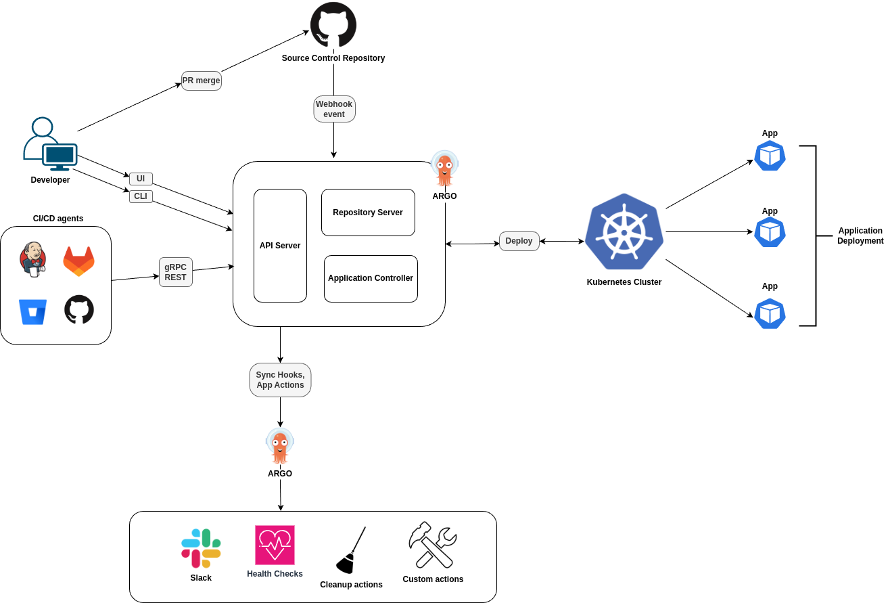

# ArgoCD Introduction

[ArgoCD](https://argo-cd.readthedocs.io/en/stable/) is a lightweight, declarative GitOps tool for continuous delivery into Kubernetes environments. It stands out with a clean, intuitive UI and a user-centric approach, making large-scale application deployment easier to manage. Unlike many traditional CD tools, **ArgoCD focuses exclusively on Kubernetes**, reducing complexity and visual clutter.

Similar tools like [**Helm charts**](https://helm.sh/), [**Kustomize**](https://kustomize.io/), [**Terraform**](https://www.terraform.io/) lack ability to manage the **state of application**.

## Key Features

### 🚀 1. **GitOps-Centric Approach**
- **Single source of truth**: Your Git repo acts as the source of truth for your desired application state.
- **Automatic synchronization**: ArgoCD continuously compares the live state of your apps in Kubernetes with what's in Git - and flags any drift.
- **Declarative deployments**: Everything is YAML-based and version-controlled.

---

### 👀 2. **Visual Interface**
- **Rich UI dashboard**: See application status, sync status, diffs, and history - all in real time.
- **Diff viewer**: Quickly compare what's deployed vs. what's in Git.
- **Multi-app view**: Manage hundreds of apps across namespaces visually.

---

### 🔄 3. **Automated Sync & Rollbacks**
- **Auto-sync**: Optionally enable automatic syncing to Git state.
- **Rollback support**: Easily roll back to a previous state or Git commit.
- **Hooks & waves**: Customize pre/post-sync hooks or control the sync order of multiple resources.

---

### 🔐 4. **RBAC and SSO Integration**
- Integrates with **OAuth2, OIDC, LDAP, SAML**, etc.
- Role-based access controls for fine-grained permissions.
- Can restrict users to only view or deploy specific apps/namespaces.

---

### 🌐 5. **Multi-Cluster Support**
- Manage applications across multiple Kubernetes clusters from a **single ArgoCD instance**.
- Great for hybrid-cloud or multi-region deployments.

---

### ⚙️ 6. **Helm, Kustomize & Plain YAML Support**
- Works out of the box with:
  - **Helm charts**
  - **Kustomize**
  - [**Jsonnet**](https://jsonnet.org/)
  - **Plain Kubernetes YAML**
- Lets teams choose their preferred templating/packaging tool.

---

### 📦 7. **Application Lifecycle Management**
- Application health status checks (e.g. Pods Running, Deployments Ready).
- History and audit logs for each deployment.
- Supports resource pruning and self-healing.

---

### 🔄 8. **CLI and API Access**
- In addition to the UI, there's a **powerful CLI** (`argocd`) and **REST/gRPC APIs** to integrate into CI/CD pipelines or automation tools.

---

### 🧩 9. **Extensibility**
- Can run custom health checks and resource actions.
- Plugins support for custom tooling and templating engines.


## ArgoCD architecture



Main ArgoCD components are:

- **API Server** - Acts as the front-end of ArgoCD, exposing a REST and gRPC API for the CLI, Web UI, and CI/CD systems to interact with the platform
- **Repository Server** - Clones and caches Git repositories, renders Kubernetes manifests using tools like Helm or Kustomize, and serves them to the Application Controller.
- **Application Controller** - Continuously monitors running applications in Kubernetes, compares them with the desired Git state, and performs sync operations to reconcile any drift.

For more information, see [ArgoCD architectural overview](https://argo-cd.readthedocs.io/en/stable/operator-manual/architecture/)

## Provision EKS cluster

To provision EKS cluster, run:
```bash
terraform apply
```

To update your local `kubeconfig` file and access cluster, run:
```bash
aws eks update-kubeconfig --region us-east-1 --name eks-cluster
```

To verify access:
```bash
kubectl get no
```

## References

- [GitHub: Kubernetes Starter Kit](https://github.com/digitalocean/Kubernetes-Starter-Kit-Developers/blob/main/14-continuous-delivery-using-gitops/argocd.md)
- [AWS Docs: Connect kubectl to an EKS cluster by creating a kubeconfig file](https://docs.aws.amazon.com/eks/latest/userguide/create-kubeconfig.html)